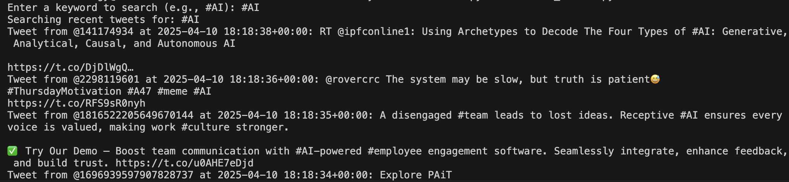
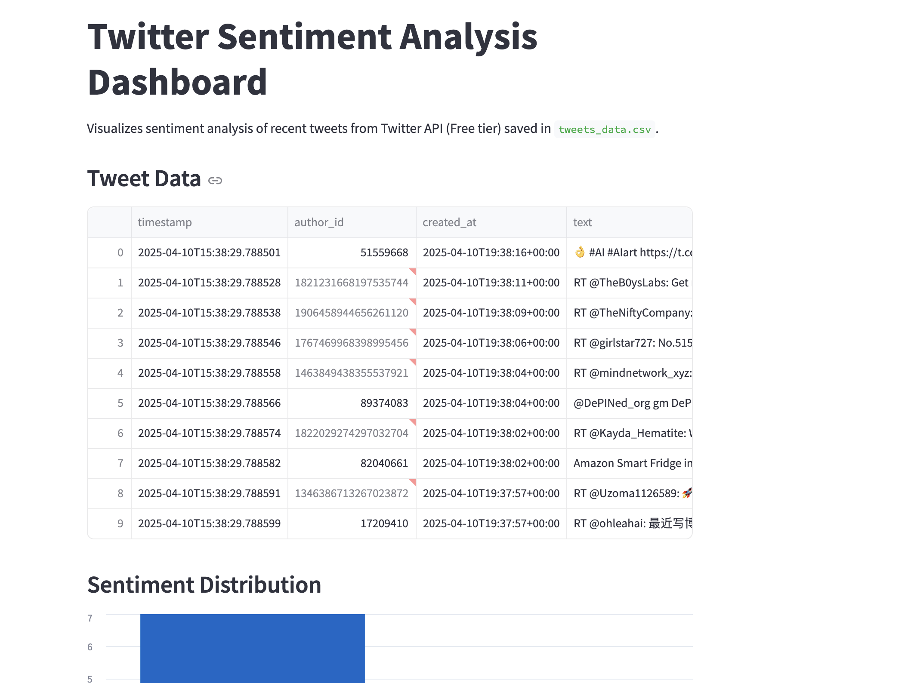

# Real-Time Sentiment Analysis Dashboard

This project, originally envisioned as a real-time sentiment analysis dashboard for Twitter/X data, has adapted to search recent tweets using keywords due to Twitter API Free tier constraints (1 request every 15 minutes). It serves as a portfolio piece to demonstrate skills in Python, API integration, machine learning, and data analysis. The current implementation fetches recent tweets and analyzes their sentiment, with mock data used when rate limits are hit. Future enhancements may include visualization with Streamlit and deployment with AWS.

- **Developed by**: [Deon Rennie]
- **Date**: April 2025
- **Environment**: Local macOS with VS Code, Python 3.9

## Environment Setup
- Uses Python 3.9 (installed via Homebrew on macOS).
- Virtual environment: `python3.9 -m venv venv`
- Activate: `source venv/bin/activate`
- Install dependencies: `pip install -r requirements.txt` (includes `hf_transfer` for faster model downloads).
- Developed locally with Visual Studio Code on macOS.

## Twitter API Integration
- Fetches recent tweets with Tweepy 4.x (Twitter API v2 Free tier, Python 3.9).
- Free tier: 1 request every 15 minutes, minimum 10 tweets per request; falls back to mock data on 429.
- Uses `.env` for Bearer Token.
- Run: `python3 stream_tweets.py`
- Developed locally with VS Code on macOS.

## Sentiment Analysis
- Analyzes tweet sentiment with Hugging Face DistilBERT (Python 3.9).
- Saves live tweet data (10 tweets/request) to `tweets_data.csv`, displays mock data on 429 (Free tier: 1 request/15 min).
- Run: `python3 stream_tweets.py`

## Visualization with Streamlit
- Displays tweet sentiment data from `tweets_data.csv` using Streamlit (Python 3.9).
- Features: Data table, sentiment bar chart, keyword filter.
- Run: `streamlit run dashboard.py` (opens at `http://localhost:8501`).
- Developed locally with VS Code on macOS.
